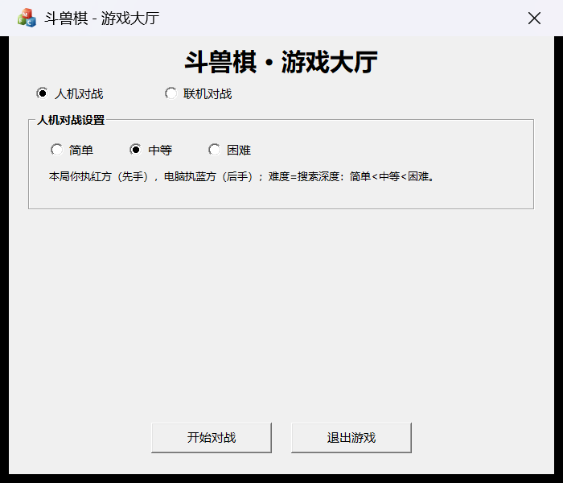
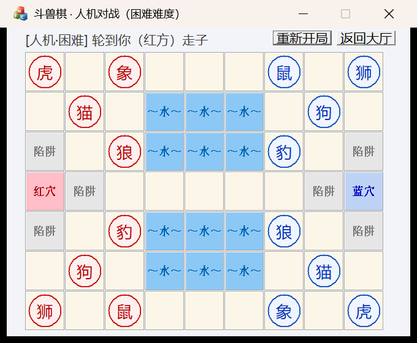
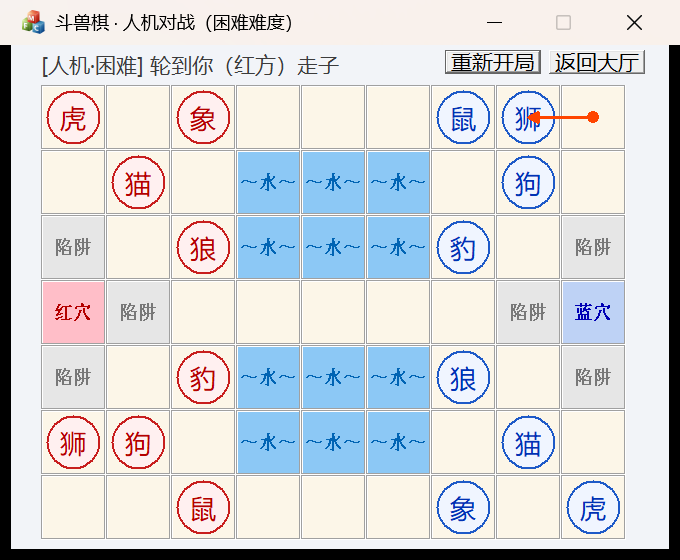
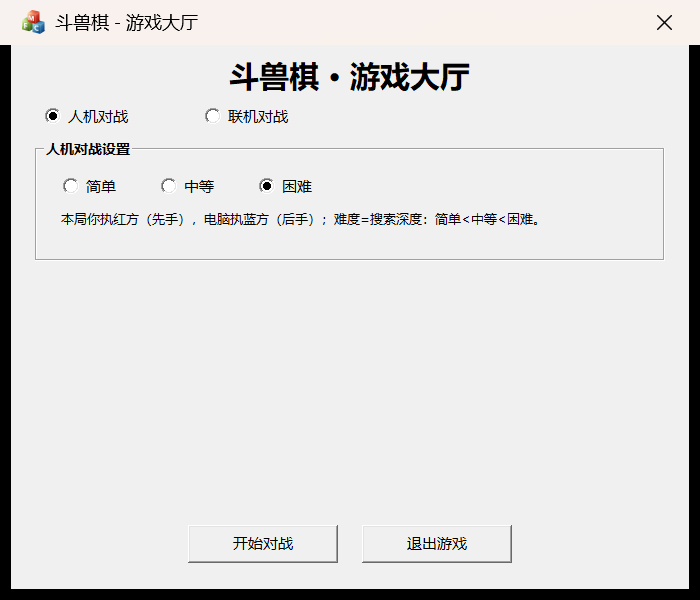
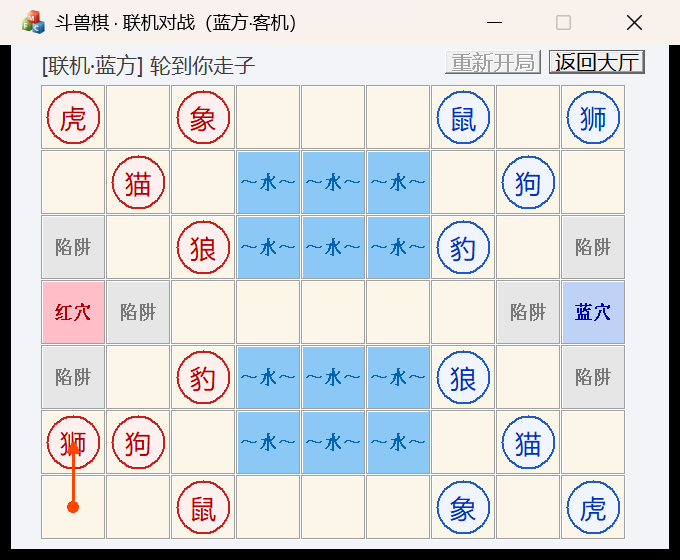

# 斗兽棋 MFC 部分说明（大厅版）

> 本包是对仓库 `animalChess-master` 中 **MFC 部分**的完善与独立打包：
> 新增 **游戏大厅界面**——可以选择「人机对战 / 联机对战」，
> 人机对战支持 **难度选择（简单 / 中等 / 困难）**；
> 联机对战支持双机（同局域网）TCP 直连对战。
> 原工程顶层 `README.md`（协议总说明）与全部源码一并保留在本目录中。

---

## 一、本包包含什么

```
animalChess-MFC-Lobby/
├── README_MFC.md              ← 本文档（MFC 部分说明）
├── README.md                  ← 原仓库顶层文档（协议总说明，保留）
├── animalChess.slnx           ← VS2022 解决方案
├── animalChess.vcxproj        ← 工程文件（x86 / x64，Debug / Release）
├── animalChess.h / .cpp       ← 应用入口：大厅 → 对局 → 返回大厅 主循环
├── LobbyDlg.h / .cpp          ← ★ 新增：游戏大厅对话框
├── AnimalChessNet.h / .cpp    ← ★ 新增：联机通信模块（TCP）
├── animalChessDlg.h / .cpp    ← 对局窗口（棋盘渲染与交互，已做模式感知改造）
├── engine.h / engine.cpp      ← 核心引擎（规则/AI，新增难度与异步思考）
├── pch.h / framework.h ...    ← 预编译头与框架头（已引入 Winsock2）
├── Resource.h / animalChess.rc← 资源（新增大厅对话框模板 IDD_LOBBY_DIALOG）
├── docs/screenshots/          ← 自动化实测截图（大厅/人机/联机）
└── res/                       ← 图标等资源
```

## 二、界面预览（自动化实测截图）

| 截图 | 说明 |
| ---- | ---- |
|  | 游戏大厅：人机/联机两种模式、AI 难度选择、联机地址/端口与连接状态 |
|  | 人机·困难难度开局（红色为玩家，右侧状态栏显示回合） |
|  | 玩家走一步后，电脑(蓝方)在后台思考并自动回应 |
|  | 对局中随时可“返回大厅”重新开局 |
|  | 联机对局：主机走子后客机端棋盘同步更新（本机双开 127.0.0.1 实测） |

## 三、新增功能一览

| 功能 | 说明 |
| ---- | ---- |
| 游戏大厅 | 程序启动后先进入大厅，而不是直接开局 |
| 人机对战 | 玩家执**红方（先手）**，电脑执蓝方（后手） |
| 难度选择 | **简单 / 中等 / 困难** 三档（见 §五） |
| 联机对战 | 创建房间（主机，执红先手） / 加入房间（客机，执蓝后手） |
| 联机连接管理 | 大厅内完成监听 / 连接 / 握手，状态实时提示，可取消、可断开重连 |
| 对局窗口 | 标题栏与状态栏标明当前模式 / 难度 / 阵营；非法回合输入被忽略 |
| 返回大厅 | 对局右上角「返回大厅」按钮，可反复开局，无需重启程序 |
| 重新开局 | 人机模式右上角「重新开局」一键重开（电脑若在思考会自动中止） |
| 异步 AI | 电脑思考在**后台线程**进行，界面不卡顿，思考中有提示 |

## 四、构建与运行

### 4.1 环境要求
- Windows 10/11 + **Visual Studio 2022**（含「使用 C++ 的桌面开发」工作负载，以及 **MFC（x86/x64）** 组件）
- 平台工具集使用 **v143**（可在 项目属性 → 常规 → 平台工具集 中切换，换成新版 VS 默认工具集亦可）

### 4.2 编译
- 方式 A：双击 `animalChess.slnx` 用 VS2022 打开 → 生成解决方案（x64 / x86、Debug / Release 均可）
- 方式 B（命令行）：

```bat
msbuild animalChess.vcxproj /p:Configuration=Release /p:Platform=x64
```

### 4.3 人机对战（快速体验）
1. 启动程序 → 大厅默认选中「人机对战」；
2. 点选难度（简单 / 中等 / 困难）→ 点【开始对战】；
3. 红方先走：**点自己的棋子（出现金色框）→ 再点目标格**；电脑思考时状态栏显示“电脑（蓝方）思考中……”，此时不能抢先操作；
4. 对局结束后可【重新开局】或【返回大厅】。

### 4.4 联机对战（两台电脑，或本机双开测试）
1. **主机**：大厅选「联机对战」→「创建房间（主机）」，点【连接】，状态栏提示正在监听（默认端口 **9002**，可修改）；
   > 若弹出 Windows 防火墙提示，请勾选“专用网络”并允许访问。
2. **客机**：大厅选「联机对战」→「加入房间（客机）」，填写主机的 **IP**（同一台电脑测试可填 `127.0.0.1`）与端口 → 点【连接】；
3. 双方状态栏显示“连接成功”，点【开始对战】；
4. 主机（红方）先行；轮到谁走，谁的窗口提示“轮到你走子”；一方中途断开，另一方会提示“对方已断开连接”并返回大厅。

## 五、AI 难度是怎么实现的

难度档位与搜索参数（`engine.cpp` 内 `EngineSearchBest / AiDepthForLevel`）：

| 难度 | 搜索方式 | 附加行为 |
| ---- | -------- | -------- |
| 简单 | 2 层 Alpha-Beta | 另有约 30% 概率直接随机选一个合法走法（模拟新手失误） |
| 中等 | 4 层 Alpha-Beta | 与原来固定深度一致（默认值） |
| 困难 | **迭代加深 2→6 层**，每层配节点预算 | 逐层加深，预算约 540 万节点封顶，思考时间可控（慢机器约 1~5 秒）；永远采用“已完成的最深层”结果 |

配套引擎改动（对外接口全部保留并新增）：
- `Engine_SetAiLevel(1|2|3)` / `Engine_GetAiLevel()`：设置 / 读取难度；
- `Engine_TriggerAiAsync()`：**后台线程**在棋盘副本上搜索，完成后在引擎锁内校验并落子，不阻塞 UI 与快照读取；
- `Engine_IsAiThinking()`：供界面轮询“思考中”状态；思考结束立即同步重绘（`OnTimer` 中 `Invalidate + UpdateWindow`）；
- `Engine_AbortAiRequest()`：请求中止思考（重新开局 / 退出程序时会自动调用；搜索每约 1024 节点响应一次中止）；
- 引擎内部增加互斥锁保护棋盘与状态快照，快照轮询与后台搜索互不干扰；
- 旧同步接口 `Engine_TriggerAi()` 保留，语义不变（按当前难度执行）。

## 六、联机协议（与顶层 README 的《协议二》一致）

数据包统一为：

```
┌──────────────┬──────────────┬──────────────┬──────────────────────┐
│ Magic (2B)   │ MsgID (2B)   │ Length (4B)  │ Body                 │
│ 0x55, 0xAA   │ 消息号        │ 包体字节数    │ (可选)               │
└──────────────┴──────────────┴──────────────┴──────────────────────┘
```

| 消息 | MsgID | 方向 | Body | 含义 |
| ---- | ---- | ---- | ---- | ---- |
| `NET_JOIN_REQ` | `0x0010` | 客机→主机 | 空 | 请求加入 |
| `NET_JOIN_ACK` | `0x0011` | 主机→客机 | `{accept, assignedCamp}`（1/0；0红/1蓝） | 同意并分配阵营 |
| `NET_MOVE_SYNC` | `0x0012` | 双向 | `{srcIndex, dstIndex}` | 同步一次走子 |

流程要点：
1. 主机监听端口（默认 9002）→ 客机连接并发送 `JOIN_REQ` → 主机回 `JOIN_ACK(accept=1, camp=1)`；约定主机执红（0）、客机执蓝（1）；
2. 任意一方走子前先经**本机引擎仲裁**（`Engine_TryMove` 按当前回合严格校验），合法后把 `MOVE_SYNC` 发给对端；
3. 对端收到后以**同一套确定性规则**再次校验并落子——双方棋盘始终保持一致，胜负与和棋由两端引擎各自得出相同结论；
4. 连接建立 / 失败 / 断开均有中文状态提示；断开后自动返回大厅重新连接。

> 说明：顶层 README 中“协议一（UE 前端 ↔ MFC 后端，9001 端口）”描述的是 UE 前端接入方案，
> 本包不含 UE 端；MFC 侧 `Engine_GetSnapshot / Engine_TryMove / Engine_TriggerAiAsync` 等
> 接口原样导出，后续 UE 前端可直接轮询快照渲染（见 §八）。

## 七、代码分层与改动清单

分层（与 README 原设计一致）：
- **engine.h / engine.cpp** —— 纯 C++ 规则与 AI 引擎，不依赖 MFC，可复用 / 移植；
- **AnimalChessNet.h / .cpp** —— Winsock2 联机封装：大厅握手 + 对局期接收线程 + 帧收发；工作线程通过自定义消息（WM_APP+10 ~ +13）与 UI 通信；
- **LobbyDlg.h / .cpp** —— 大厅界面与连接状态机（空闲 → 连接中 → 已连接）；
- **animalChessDlg.h / .cpp** —— 对局窗口：快照渲染、按模式约束的点击输入、异步 AI 轮询、联机消息处理；
- **animalChess.cpp** —— 主循环：大厅 →(开始)→ 对局 →(返回大厅)→ 大厅…；退出时回收 AI 线程与 Winsock。

相对原仓库的改动：

| 文件 | 改动 |
| ---- | ---- |
| LobbyDlg.h/.cpp、AnimalChessNet.h/.cpp | 新增 |
| engine.h/.cpp | 新增难度等级、异步 AI（后台线程 + 中止/节点预算）、引擎互斥 |
| animalChessDlg.h/.cpp | 模式感知输入（人机红方 / 联机按阵营）、异步 AI 触发与状态提示、返回大厅 / 重新开局按钮、联机消息处理 |
| animalChess.cpp | InitInstance 改为大厅循环；退出前回收 AI 线程与 Winsock |
| pch.h | 预编译头中先引入 Winsock2（避免与 windows.h 冲突） |
| Resource.h / animalChess.rc | 新增 IDD_LOBBY_DIALOG 大厅对话框模板 |
| animalChess.vcxproj(.filters) | 加入新文件；统一加 /utf-8；平台工具集改为 v143；启用 Per-Monitor DPI 感知（高分屏下界面清晰且点击坐标准确） |

## 八、给 UE 组（或其他前端）的对接提示

- 引擎导出接口保持稳定（见 `engine.h` 内注释）：`Engine_GetSnapshot` 拉取 63 格快照、`Engine_TryMove` 提交走子、`Engine_TriggerAiAsync` 驱动电脑；
- 人机模式下玩家永远是红方；引擎只接受“当前回合方”的走子请求；
- 联机对战的消息格式（0x55AA 帧 + 三个消息号）可直接复用；若需要“协议一”的 9001 端口服务端（供 UE 轮询），可在 MFC 侧仿照 `AnimalChessNet` 增加一个监听线程即可，本包为控制范围未包含。

## 九、已知限制

1. 联机对战适合同一局域网；跨公网需自行做 NAT / 端口映射，程序未做加密与校验和；
2. 联机断开即返回大厅，不支持断线后续连同一局；
3. “困难”难度在慢机器上单步思考可能达数秒（界面保持响应，状态栏显示“思考中”，可随时重开 / 退出中止）；
4. 全部文字 / 绘制为简体中文，UI 未做多语言。

---
*本文件为课程小组作业中 MFC 子系统的交付说明；截图来自本机自动化实测（Release x64）。*